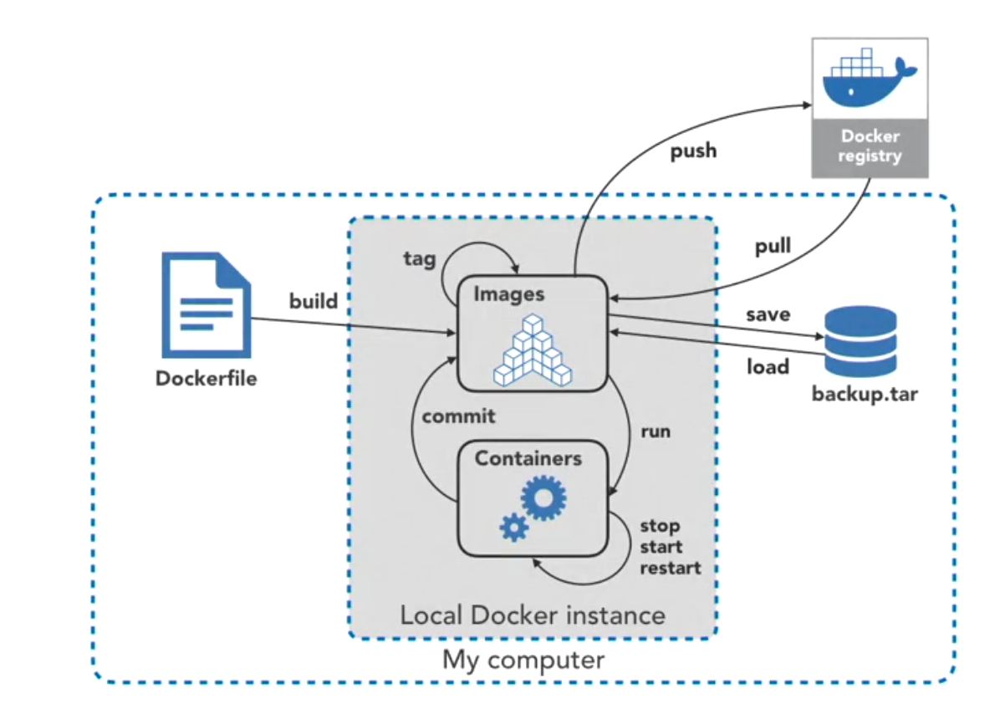
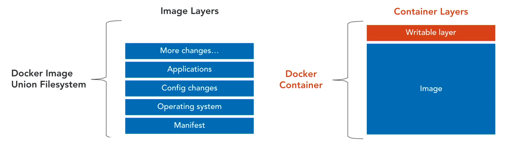
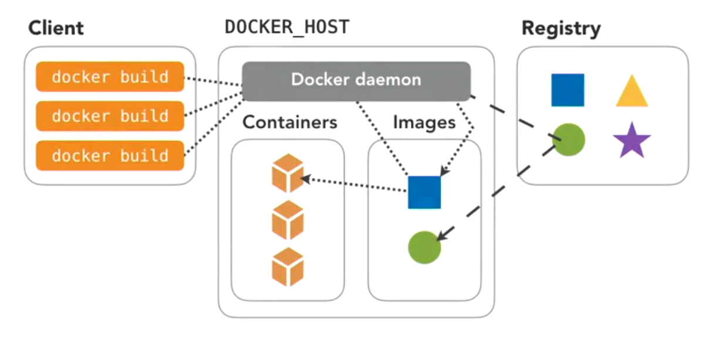

# 3 Docker Images

## 3.1. Understanding Docker Image 

_An image is an executable package that includes everything needed to run an application - the code, a runtime, libraries, emvironment variables and configuration files._ 

A container is a runtime instance of an image. i.e. an image is a container that is not running.


### 3.1.1. Layered file systems


* Images are made up of __read-only__ layers.
* Multiple containers are typically based on same image.
* When an imgage is instantiated into a contaier, __a top writable layer is created__, which is deleted when the container is removed. 
* Docker uses __storage Drivers__ to amange the contents of the image layers and the writable container latyers. 
* Each storage driver handles them implementation differently.
* All drivers use stackable image layers and __copy-on-write__ (COW) strategy. 
* This is why Docker containers are called __state-less__

### 3.1.2. Dockerfile

* A dockerfile is a text file that contains all the commands, in order, needed to build a given image. A dockerfile is executed by the `docker build` command.
* The `docker build` command looks for the `Dockerfile` by default if not specify explicitly. 

```
# A sample Dockerfile
FROM    ubuntu
LABEL   Description = "This is a test Dockerfile to install python"
RUN     apt -y update && apt -y install python3 \
                                        python3-pip \
                                        openssh-server
```

Now run execute the Dockerfile

```
docker build . -t rishiCSE/ubuntu_py:v2    #building and image with tag
```

__Verification__

1. Check the image ID of the newly created image using `docker images` command 
2. Check the information prvided onto the Dockerfile in the image using `docker inspect {image_ID}` comamnd
3. Check the order the commands/layers are applied using `docker image history {image_ID}`
4. If Dockerfile is located elsewhere `docker build -f {PATH} {build_context}` command.  Specific attention to be taken when building a docker image from a remote Dockerfile. By default the `build_context = .` which includes all files at that directory to be part of the docker file-system. The `build context` specifies which files to be included. 

__List of Dockerfile commands__ 


| Command | Meaning |
|---|---|
| ADD | Copies a file into the image, also supports tar and remote URL |
| COPY| copes a file into the image, but preffered over ADD |
| VOLUME | Creates a mount point as defined, when the container is run | 
| ENTRYPOINT| Executable runs when a container is run | 
| EXPPOPSE | Documnets the ports that sould be published | 
| CMD | Provides arguments for the entrypoint (only one is allowed) |
| ENV | Denies the environmental variable in the container |
| FROM | Defines the base image; the FROM instruction must be the first instruction in the Dockerfile |
| MAINTAINER | email of the author (Depcricated) |
| ONBUILD | Only used as a trigger when this image is used to build other images; will define command to run "on-build" |
| RUN | Runs a new command in a new layer |
| WORKDIR | Defines the working directory of the container | 

### 3.1.3. Managing images
`docker image {Options}`

|options | Meaning |
|---|---|
|build       | Build an image from a Dockerfile|
|history     |Show the history of an image|
| import      |Import the contents from a tarball to create a filesystem image|
| inspect     |Display detailed information on one or more images|
| load        |Load an image from a tar archive or STDIN|
| ls          |List images (deprica `docker images`)|
| prune       |Remove unused images (Dangliing image is one that does not have a tag), `docker image prune -a` removes all images that is not associated to any containers |
| pull        |Pull an image or a repository from a registry|
| push        |Push an image or a repository to a registry|
| rm          |Remove one or more images (depricated `docker rmi`)|
| save        |Save one or more images to a tar archive (streamed to STDOUT by default)|
| tag         |Create a tag TARGET_IMAGE that refers to SOURCE_IMAGE|

### 3.1.4. Dockerfile best practices
1. build context must be taken into consideration.
2. `.dockerignore` file specifies certain file patter to be ignores to be included while building.
3. Each container should be of sinigle __Concern__ i.e. runnning single application.
4. Break multiple instrucion into multi-line using `\` for better organization.
5. Link togather `apt -y update && apt install`
6. Use `docker build --no-cache=True ...` to deactive caching.

## 3.2. Image Management 

### 3.2.1. inspect command 
* `docker {iamge|container} inspect {IMAGE_NAME | CONT_NAME}` inspects the docker image formation.  
* Docker inspect command outputs in JSON format. 
* Filtering information could be done on the inspect output 
    1. `docker image inspect {image_id} > {file_name}` then use linux text filtering. 
    2. `docker image inspect {image_id} --format='{{ .id }}'` : shows the ID of the image, where `.ID` being the key of the JSON output and the `{{}}` being the placeholder. 
    3.  `docker image inspect {image_id} --format='{{json .id }}'` : returns the key:value pair in JSON format. 
    
### 3.2.2. Tagging an image 

* Docker tag is used to tag an image with its version. 
* `docker image tag {Image_ID} {Repo_name}:{version}` e.g. `docker image tag 123 ubuntu:latest` 
* One image can have multiple tags. All point to the same image ID. (__Tags are aliases__).
* __Naming Convesion__: `{username}/{repo}:{version}` e.g. `rishiCSE/ubuntu:latest` 

    
### 3.2.3. Modefied image-layers 

* Sometimes having multiple image layers is not a good option. therefore layers could be compressed into one layer. There are techniques for it
* __Option 1: Squash__ : The squash file system is comresses a multiple layers into a single layer 
    1. Check if the docker server has __experimental__ feature enabled, if yes then jump to step 5.
    ```
    docker version
    ```
    2. create a file `sudo nano \etc\docker\daemon.json` and put the following info.
    ```
    {
        "experimental" : true
    }
    ```
    3. Restart the docker service 
    ```
    sudo systemctl restart docker
    ```
    4. Verify : This will activate experimental features 
    ```
    docker version 
    ```
    5. Build with squashing layers 
    ```
    docker build --squash -t rishiCSE/ubuntu_py:v3 . 
    ```
    6. Verify 
    ```
    docker image history rishiCSE/ubuntu_py:v2
    docker image history rishiCSE/ubuntu_py:v3
    ```
* __Option 2: Import/Export__ 
    1. Run the container as a daemon 
    ```
    docker container run -d --name=test rishiCSE/ubuntu_py:v2
    ```
    2. Export to a tar file 
    ```
    docker ps    # get the name if needed ]
    docker container export test > test/tar    # export to a .tar file by compression
    ```
    3. Import to the image repo
    ```
    docker image import test.tar
    ```
    4. Verify layers
    ```
    docker image hostory {Image_name} 
    ```

## 3.3. Docker Registry 

_A docker registry is a stateless, highly scalable application that stores and lets you distribute Docker images. Registries could be local(provate) or cloud-based (private/public)._

__Type of docker registries__
1. Docker Registry (Local opensource registry)
2. Docker Trusted Registry (DTR) : Docker enterprize feature 
3. Docker hub : Cloudbased 
 
### 3.3.1. Deploying a local docker regiatry 
1. Deploying a local registry 
```
docker run -d -p 5000:5000 --restart=always --name registry registry:2
```
2. verify 
```
docker ps
```
3. tag a container appropreate for the local registry 
```
docker tag ubuntu localhost:5000/ubuntu:v2 
```
4. Push the new image to the local repo
```
docker puch localhost:5000/ubuntu:v2 
```
5. Now remve the image from default image registry.
```
docker image rm localhost:5000/ubuntu:v2 
```
6. Pull it from the local registry 
```
docker pull localhost:5000/ubuntu:v2 
```

### 3.3.2. Using dockerhub
1. Create an account at docker hub 
2. Login using CLI 
```
docker login   # suuply credential (username/password)
```
3. to logout 
```
docker logout
```

### 3.3.3. Push/pull/sign 
1. Pushing or pulling an image 
```
docker {push|pull} {image_name} # docker creates a new repo when pushing with appropreate format
```
2. __Docker content trust__ allows to digitally sign ant docker image using a public/private key. Siginging is only available on Enterprize.  
3. __Docker Notary__ is a feature for docker community edition where you create your own content trust without any CA. 

### 3.3.4. Searching 
* Use docker search to search for a given docker image in docker hub. 
```
docker search {image_name}
```
* Use `--filter` to specify your search 
```
docker search --filter=star=3 {image_name}  # gives list of 3* iamges with given name
```
```
docker search --filter=star=3 \
              --filter=is-official=true {image_name}  # gives list of official iamges with 3* of given name
```
* Docker search provides __25__ results by default. Use `--limit` command to control the outputs. 
```
docker search --limit {1-100} {image_name}   # gives top images soeted by starts (descending) 
```
